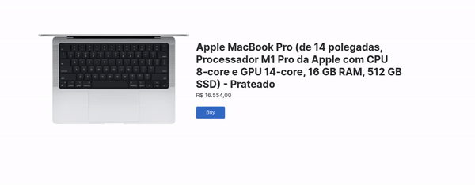

# Image Zoom 

I use the OOP concept to build this simple project up.

---

## Result

At this project you can see how work with mouseover, mouseleave e mousemove events. As soon as possible i'll implement the mobile events at this project and make it responsive.