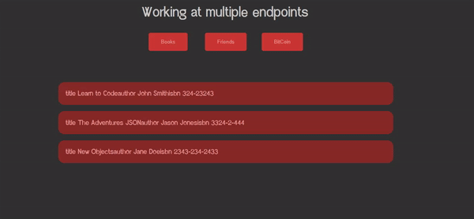

# Working at multiple endpoints

I got in this project three API's that has a data's list structured as json
Creating this project i've learning how to work, in a simple way, at multiple enpoints

## Preview

