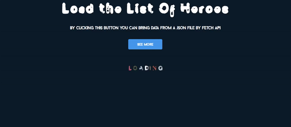

# Loading informations from a local json file

Using the fetch API i can read a local json file and load data about title, description and the path's image.

I created an animation that indicate when the all data are loading.

## Here is the loading animation

## Final result

